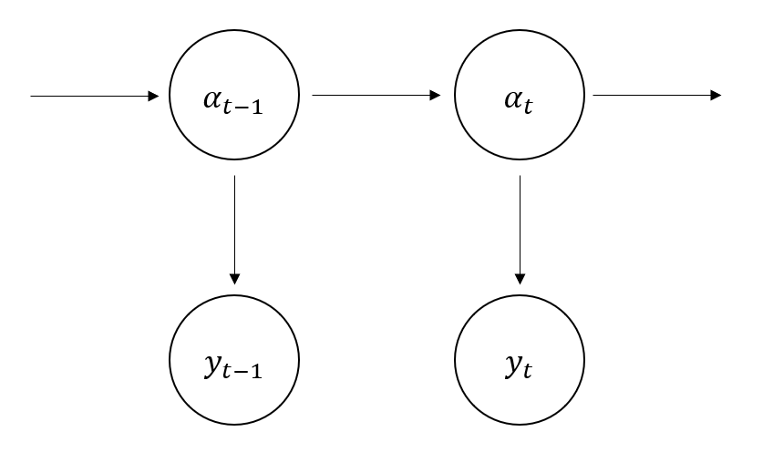
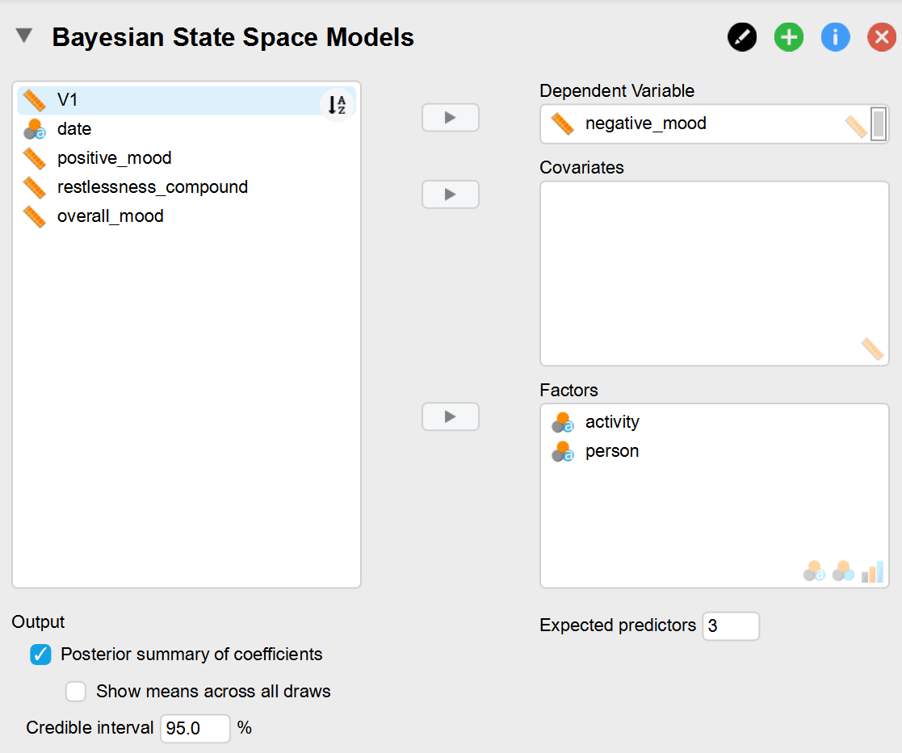
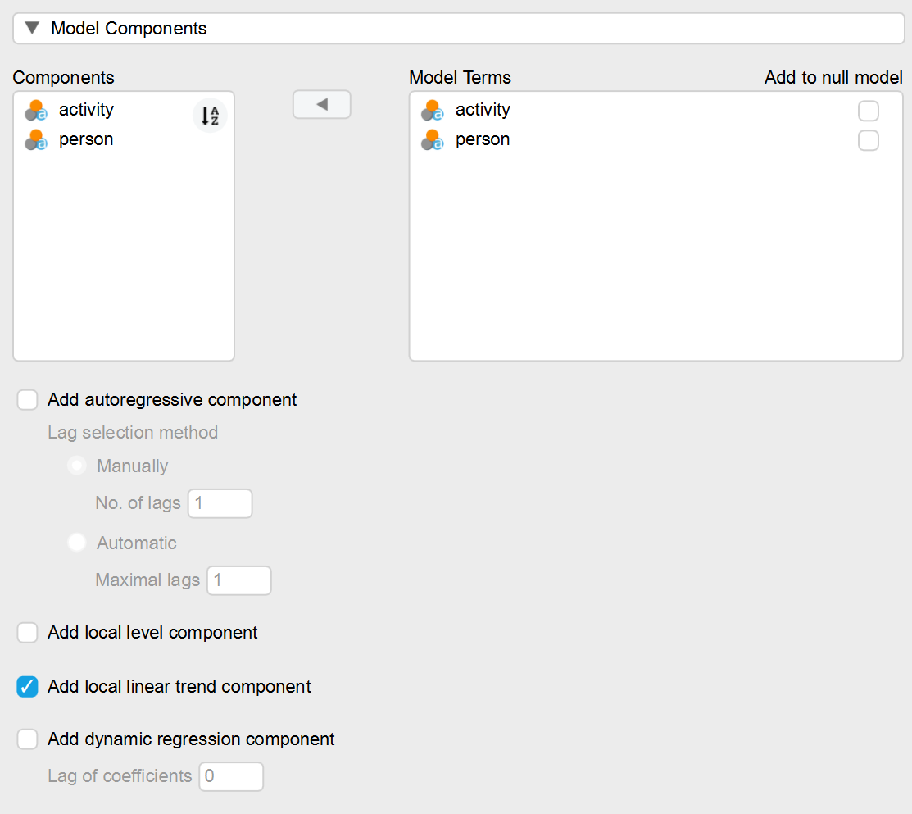

# Bayesian State Space Models in JASP

This blog article demonstrates how to use the new Bayesian state space JASP module to analyse time series data. Normally, state space models are difficult to construct, but the new module makes the powerful state space approach available with the click of a few buttons! It is based on the `bsts` package [@scott2020] which covers Gaussian linear state space models and deconstructs a time series into individual components, such as trends or seasonality. It also allows for Bayesian variable selection, prediction about future values, and control charts.

## Quick introduction to state space models

Most readers might not be familiar with state space models, so let us briefly introduce them. It would be beyond the scope of this blog post to explain them in full detail, so feel free to check out [this](https://kevinkotze.github.io/ts-4-state-space/) and [this](http://oliviayu.github.io/post/2019-03-21-bsts/) excellent blog posts. State space models generally assume that we have a hidden state $\alpha_t$, which changes over time and is the data generating process behind our actual observations $y_t$. And while we can't directly observe the hidden states containing our parameters of interest, we use the observations to estimate them. Figure 1 depicts how the individual observations only depend on the corresponding state, while each state depends on its previous iteration (also known as a hidden Markov chain).

{width="500"}

What makes state space models so flexible is that the hidden state $\alpha_t$ can contain a wide variety of parameters such as trends, seasonality or (auto)regressive components. This allows us to tweak the parameters to capture a wide variety of time series data. The model that we will use is the so called **local linear trend model**. Here the state follows a trend which is defined by its mean $\mu_t$ and a slope $\delta_t$ (i.e., $\alpha_t = \bigl( \begin{smallmatrix}\mu_t\\ \delta_t \end{smallmatrix}\bigr)$).

$$y_t = \mu_t + \epsilon_t\\
\mu_{t+1} = \mu_t + \delta_t + \eta_{\mu,t}\\
\delta_{t+1} = \delta_t + \eta_{\delta,t}$$

The first so called *observation equation* denotes that our observations $y_t$ are the result of the state or rather its trend mean plus $\epsilon_t$ where $\epsilon_t \sim \mathcal{N}(0,\sigma^2_{\epsilon})$. Furthermore, the first *state equation* denotes that the state at time point $t+1$ will be the mean of the previous state $\mu_t$ plus some downward or upward shift $\delta_t$ plus $\eta_{\mu,t}$ where $\eta_{\mu,t} \sim \mathcal{N}(0,\sigma^2_{\mu})$. Additionally, the second *state equation* denotes that the slope follows a random walk which allows it to vary slowly over time as the error term $\eta_{\delta,t} \sim \mathcal{N}(0,\sigma^2_{\delta})$ is added to the previous iteration. Since we now understand state space models a bit better, we will take a look at the JASP module and how we can select the local linear trend model (including covariates) for some example data.

## Example 1: How does negative mood vary over time and by what variables is it affected?

Kossakowski and colleagues [-@kossakowski2017] collected a data set which is suitable for demonstrating the functionality of the bsts module: A previously depressed participant filled out an experience sampling questionnaire multiple times a day for 239 days. The questionnaire contained items about current mood but also qualitative questions regarding activity and social contact.

We will use the *bsts* module to demonstrate how we can answer the question "Does the negative mood follow a trend?" and "Which variables predict negative mood the best?". We achieve this by decomposing the negative mood of the participant into a time-varying trend, as well as a regression component. To do so, we simply extend the equations above by adding the regression component $\beta x_t$ to the observation equation:

$$y_t = \mu_t + \beta x_t + \epsilon_t\\
\mu_{t+1} = \mu_t + \delta_t + \eta_{\mu,t}\\
\delta_{t+1} = \delta_t + \eta_{\delta,t}$$

In this example $y_t$ are our observations of the restlessness variable, while $\mu_t$ is the trend mean of our state. Additionally, $\beta$ refers to a vector that contains all of the regression coefficients and $x_t$ to a vector that contains the values of each predictor variables at time point $t$. Compared to the other state components, the regression coefficients do not vary over time and stay the same as denoted by the lack of the subscript $t$.

We obtained the negative mood variable by averaging the items that asked about the strength of feeling down, lonely, anxious, suspicious, guilty, doubtful and tired. The predictor variable "activity" indicates what the participant was doing while filling out the survey (e.g. working or talking) and the predictor variable "person" indicates with whom he was with (e.g. colleagues or partner). As the predictors are categorical variables, we have a dummy variable for each level (i.e. each activity and person) that is either 0 or 1 depending on whether the corresponding level is present at time $t$. For example, at $t=123$ the participant engages in the activity "nothing" and is with his "partner". Thus, the dummy variables for "nothing" and "partner" are equal to 1 and all other dummies are 0. This simplifies the model to:

$$
y_{123} = \mu_{123} + \beta_{nothing} + \beta_{studies} + \epsilon_t\
$$

In order to identify the most important predictors we make use of so-called spike-and-slab priors: Additionally to our regression coefficients $\beta$ we have a the vector $\gamma$ of the same length whose elements are either zero or one. It determines whether a specific coefficient is included in the model as $\gamma_i =1$ indicates that $\beta_i \neq 0$, while $\gamma_i = 0$ indicates that $\beta_i = 0$ and thus is included in the model. We integrate our prior expectations regarding $\gamma$ via the following Bernoulli prior:

$$
\gamma \sim \prod \pi_i^{\gamma_i} (1-\pi_k)^{1-\gamma_i}.
$$

Here $\pi_i$ reflects the probability that a particular $y_i =1$. This allows us to give more weight to predictors that seem promising or have been found to be impactful previously as a higher inclusion probability makes them more likely to be selected. However, when no specific prior information about the inclusion of certain predictors is available, it is common to set $\pi=p/K$. Here $p$ reflects the average number of predictors we expect to be included in the model and $K$ the number of total predictors possible. Setting the prior this way is the only option for now.

Now that the mathematical details are out of the way, let's create that model with JASP! After loading the data set, the first step is to select the dependent variables and predictors. As shown in Figure 1, we moved the negative mood variable "negative_mood" to the "Dependent Variable" box and the two predictor variables "activity" and "person" into the "Factors" box. If we would have continuous predictor variables instead of categorical ones, we would have moved them into the "Covariates" box.

{width="800"}

As a next step, we select the "Posterior summary of coefficients" check box as we want JASP to display an output table containing the marginal posterior summary of the coefficients, which also includes the inclusion probability and the Bayes Factor.

Another important step is to adjust the "Expected predictors" option. As we don't have any prior knowledge of which specific predictors are likely to be included in the model, we use the aforementioned approach: Since we expect around 3 predictors out of 16 (plus intercept) to be included in the model, the prior inclusion probability for each predictor is $\pi_k= 3/17=0.176$. After having observed the data, this prior information is updated to the posterior which tells us which predictors are most likely to be included across all possible models.

Now that we have specified our dependent variable and our regression component, we only need to specify the local linear trend of our state space model. In Figure 3 you can see the various components we could add to the model, but for our intended model, we only have to click the button "Add local linear trend component". Note that inference of the model can be very slow depending on the number of samples of the MCMC algorithm (2000 by default) and how long the time series is.

{width="800"}

Now let's take a look at the results. The first table we can see gives us information about the general fit of the model. The residual standard deviation $\sigma^2 _\epsilon$ answers the question of how well each state captures the corresponding observation. The prediction standard deviation answers the question of how well each estimated state predicts next observation given the data until t-1 and thus can be used to asses the predictive accuracy of the model:

$$e=y_t-a_{t|t-1}$$ The $R^2$ on the other hand tells us that around 50 percent of the variance in negative mood is explained by our local linear trend plus the regression component. The Harvey's goodness of fit is similar to $R^2$ but adjusts for the fact that trending/non-stationary time series (i.e. do not have a constant mean and variance) can inflate the normal $R^2$ measure [for mathematical details see @harvey1990, page 268].

{width="500"}

As mentioned before the package allows us to integrate our prior knowledge regarding the number of predictors and updates the probability of them being included in the model after having seen the data. Table 2 tells us the results of this updating process.

{width="800"}

As we can see the prior inclusion probability *P(incl)* directly relates to the expected model size of 3 we set earlier. The next column *P(incl\|data)* gives us the posterior inclusion probability or in other words the updated inclusion probability after having seen the data. So what exactly does this column tell us?

In order to identify the most important predictors, we make use of **Bayesian model averaging**, which means we average across the 2000 MCMC iteration we selected earlier. Looking at the second column, we have the posterior inclusion probability which tells us what percentage of models included each predictor. For example, the most important predictors are *doing nothing*, *being with the partner* and *being with colleagues* as they were included the majority of times. In fact, doing nothing and being with the partner have an inclusion probability of 1 meaning they were included in all of the 2000 models, while being with colleagues was included in around 0.97 percent. This provides strong evidence for the inclusion of these 3 predictors whole all other predictors decreased in likelihood.

This is also reflected by the Bayes factors for inclusion which quantifies by which factor the odds of including a specific predictor have increased and is often used to measure the strength of evidence in Bayesian inference. It is calculated by diving the inclusion probability of a predictor by the exclusion probability:

$$BF_{inclusion} = \frac{P(incl|data)}{1-P(incl|data)}$$For *doing nothing* and *being with the partner*, the Bayes factor of infinity tells us that we have incredibly strong evidence in favor of including these two predictors in the model. The inclusion probability for *being with colleagues* is 0.97 so we can divide it by the exlusion probability of (1-0.97) and arrive at a BFinclusion of 32.

On the other hand, the odds of including any other predictors have decreased: For example the odds of including talking with others has decreased by a factor of 1/0.153 = 6.5.

On a side note, it is important to not note that the choice of our prior aka the expected model size does not matter too much if we have strong evidence. For example, if we would have set the expected model size to 2 or possibly 5, the number of predictors would stay the same as the posterior will be similar since the data provided so much evidence.

But how large are the coefficients? This is indicated by the *Mean* column which gives us the posterior means for each coefficient. It tells us that doing nothing **increases** the negative mood of the patient by 0.48 points on average, while being with the partner or collegues **decreases** it by 0.122 and 0.401 points respectively.

Now that we have talked about the regression component, it is time to look at the local linear trend component of the model. Compared to the regression coefficients we assume it is always included in the model. Since the component is time varying, looking at a plot is much more informative than a table. The "Component state plot" under the "Plot" section nicely divides the contribution of each component of our model. Looking at Figure 3, the upper portion with the label "trend" refers to the local linear trend component $\mu_t$. The x-axis denotes time, the y-axis denotes the values of the state components, the black line denotes the mean and the blue shading around it denotes the 95% credible interval around it.

The plot shows us that the trend stays between 2 and 2.5 most of the time but does not rise or fall strongly. Rather the variance of the variable stays relatively small for the first 500 time points and becomes larger afterwards, which is reflected by the more extreme up and down jumps in the trend.

On the lower half of the plot we see the contribution of the regression component $\beta x_t$ visualised. For example, at the time point 123 the participant does nothing and is with his partner. If we take the values for the coefficients $\beta_{nothing}$ and $\beta_{partner}$ we arrive at a regression contribution of $\beta*x_{100} = - 0.122+0.48 =0.358$. This indicates that at $t = 123$ the regression component of the state space model is responsible for an increase of 0.358 points in negative mood.

{width="700"}

The final plot to investigate is the one that combines the trend component with the regressive component. It can be activated by clicking the "Aggregated state contribution" box. The values shown in this plot are simply the sum of both state components as the trend now has the up and down jumps from the regression plot we could see in the previous plot. For example at time point 123 we have the aforementioned of 0.358 and a trend contribution of 2.1. Thus the estimated aggregated state will be:

$$
\alpha_{123} = \mu_{123} +\beta*x_{123} = 2.1 + 0.358 = 2.458
$$

{width="700"}

## Example 2: Can we detect early warning signs of a depression relapse?

Another interesting application to this data set is the possible detection of early warning signs for a depression relapse as the patient eventually relapsed into depression. Smit and colleagues [-@smit2019] discovered that restlessness increased substantially more than two months prior to depression relapse in two patients. They applied an exponentially weighted moving average (EWMA) model to the data and calculated this critical threshold based on the baseline where the patient was still under antidepressant medication (first 100 time points).

However, the EWMA model uses simple cut-off values for whether or not restlessness exceeds a threshold. And while we could use the confidence intervals of the model they would only be able to tell us with which frequency the intervals would contain the true parameter if we resalmple the data again and again (e.g. 95 percent of the time). Especially since the data is impossible to collect again, we are much more interested in how likely it is that the true value exceeds our threshold. Using the Bayesian state space model, we are able to quantify our uncertainty about whether the data exceeded the threshold in probabilistic terms.

As a first step, we calculate the mean for each day of the data set. This is necessary because the Bayesian state space model (as well as the EWMA model) assumes our observations to be normally distributed and the raw data is not. The resulting histogram can be found in Figure 6.

{width="500"}

We then apply a state space model with only a local linear trend component (as discussed in the beginning of the blog post). As we use daily data and the raw first 100 time points span over 17 days, we will use the first 17 averaged daily time points to calculate the baseline. We take the mean of the first 17 state estimates and then add and subtract two standard deviations: $Threshold = \mu_{\alpha_{1:17}} \pm 2*\sigma_{1:17}$. We use the estimated hidden state instead of the actual observation to calculate the threshold as the state space model estimates the **true** hidden state from our noisy observations. In JASP, we can select this option via the "Show control chart" option under "Plots," setting the "Control period end" to 17 and activating the "Show probabilistic control plot" option.

Looking at the aggregated state in Figure 7 we can clearly seethat compared to negative mood in our first example, the trend of restlessness increases over time. The two red dotted lines are the two critical thresholds and whenever the blue shaded area exceeds the red line, whether our threshold is exceeded. The note at the bottom tells us that the first time restlessness exceeds the threshold is on the 28th of September. This is more than two months before the patient relapsed into depression (mid of December) and coincides with the results by Smit and colleagues.

It is very important to note that the selection of a threshold is arbitrary and thus needs to be theoretically grounded: Depending on how many standard deviation we use to construct the threshold that indicates a substantial increase in a variable, we can easily generate false positive results if we make that choice after having obtained the data. Furthermore, restlessness was the only variable of multiple to be identified retrospectively as a warning sign without there being a lot of evidence in the existing literature that supports this. Thus in order to conclude that increasing restlessness could truly function as an early warning sign and avoid generating false positive results, planned replications are needed that decide on a variable and threshold before data collection.

{width="600"}

## Summary

In this blog post, we provided overview of what is possible with the new Bayesian state space module in JASP. We showed how we can decompose a time series into different components: We identified that *doing nothing*, *being with friends* or *with the partner* affects the negative mood of an exemplary participant the greatest while there is no great trend over time present. Furthermore, we used the module to answer in probabilistic terms whether restlessness rises above a threshold. If you want to test out the module before it is available in an upcoming JASP version, you can find it [here](https://github.com/petersen-f/bstsIntershipProject/tree/main/jaspBSTS)! The R file used for preprocessing and the two JASP files are available [here](https://osf.io/65vna/).

## References
