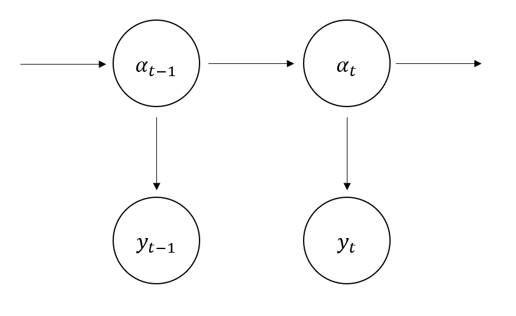
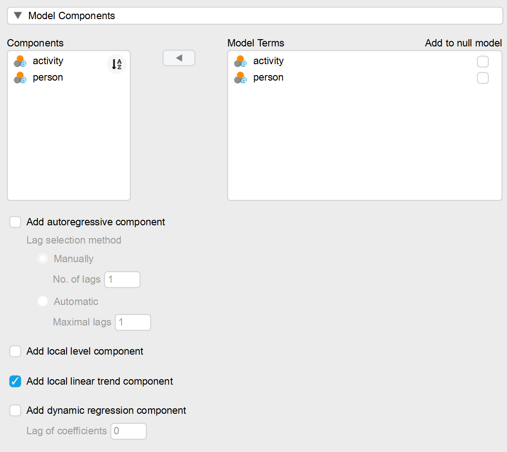
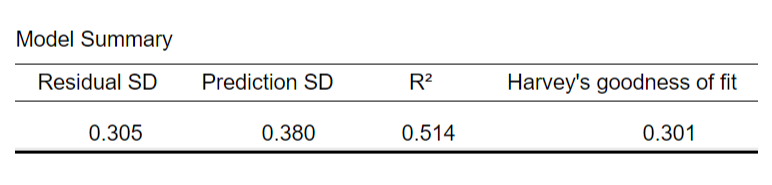
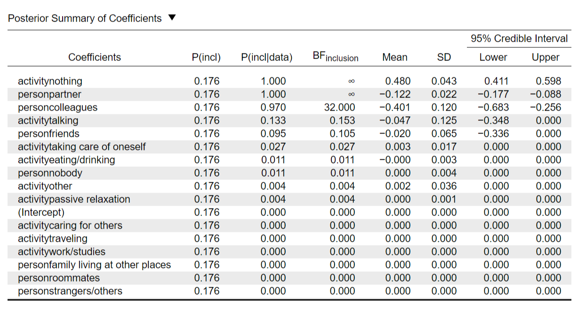
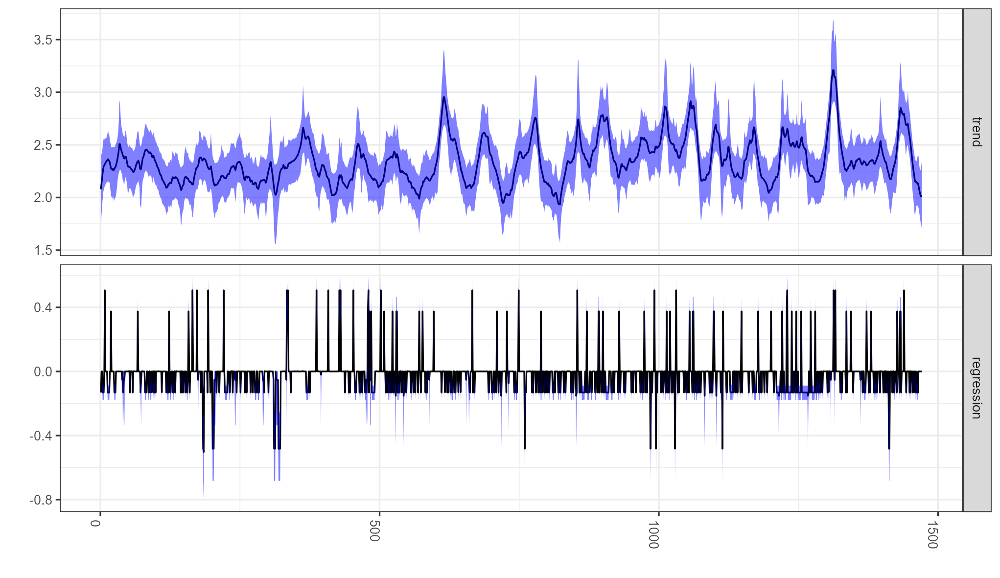
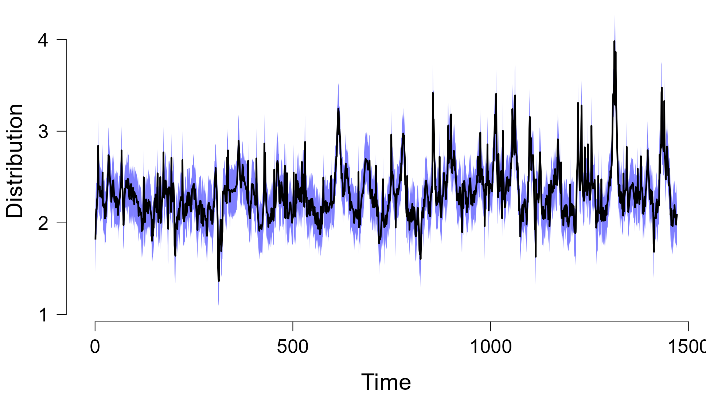
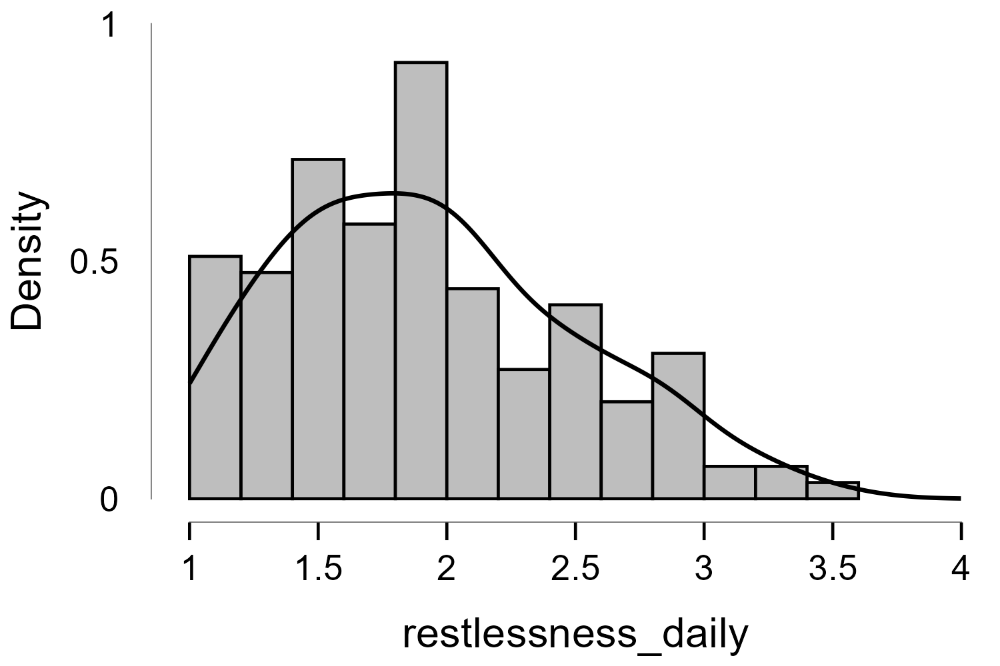
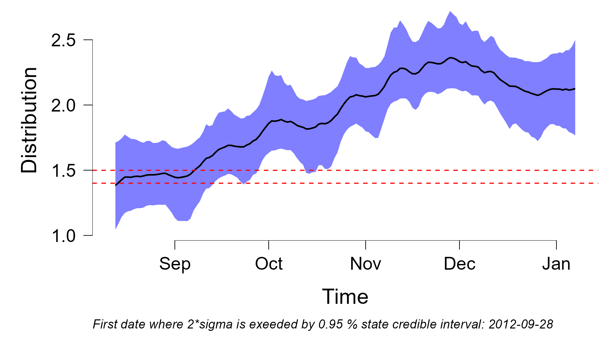
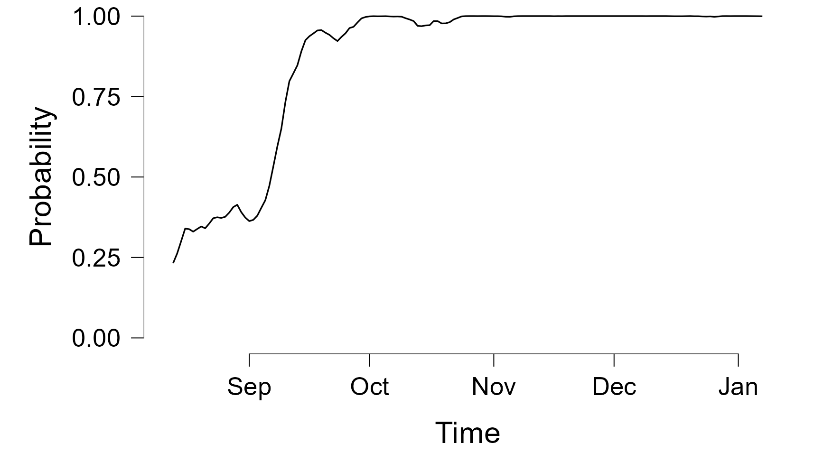

# Bayesian State Space Models in JASP

This blog article demonstrates how to use the new Bayesian state space JASP module to analyse time series data. Normally, state space models are difficult to construct, but this new model makes this powerful approach available with the click of a few buttons! It is based on the `bsts` package [@scott2020] which covers Gaussian linear state space models and deconstructs a time series into individual components such as trend or seasonality. It also allows for Bayesian variable selection, prediction about future values and control charts.

## Introduction to state space models

Since most readers might not be familiar with state space models, let's quickly recap them. Since it would be beyond the scope of this blog post to explain them in full detail, feel free to check out [this](https://kevinkotze.github.io/ts-4-state-space/) and [this](http://oliviayu.github.io/post/2019-03-21-bsts/) excellent blog post. State space models generally assume that we have a hidden state $\alpha_t$ which changes over time and is the data generating process behind our actual observations $y_t$. Figure 1 nicely depicts how the individual observations only depend on the corresponding state, while each state depends on its previous iteration (which is also knows as a hidden Markov chain).

What makes state space models so flexible is that the hidden state $\alpha_t$ can contain a wide variety of parameters such as trends, seasonality or (auto)regressive components. The model that we will use is the so called **local linear trend model**. Here the state follows a trend which is defined by its mean $\mu_t$ and a slope $\delta_t$. The exact notation would be:

$$y_t = \mu_t + \epsilon_t\\
\mu_{t+1} = \mu_t + \delta_t + \eta_{\mu,t}\\
\delta_{t+1} = \delta_t + \eta_{\delta,t}$$

This basically means that our observations $y_t$ are the result of the state or rather its trend mean (plus some noise). Furthermore the state evolves in such a way at time point $t+1$ it will be the mean of the previous state $\mu_t$ plus some downward or upward shift $\delta_t$ . Additionally, the slope follows a random walk. Since we now hopefully understand state space models a bit better, we will take a look at the JASP module and how we can select the local linear trend model (plus some regressors) for some example data.

## Example 1: How does negative mood vary over time and by what variables is it affected?

Kossakowski and colleagues [-@kossakowski2017] collected a data set which is suitable for demonstrating the functionality of the bsts module: A previously depressed participant filled out an experience sampling questionnaire multiple times a day for 239 days. The questionnaire contained items about current mood but also qualitative questions regarding activity and social contact. We will use the bsts module to demonstrate how the negative mood of the participant can be divided into a trend component that changes over time, as well as a regression component.

We obtained the negative mood variable by averaging the items relating to feeling down, lonely, anxious, suspicious, guilty, doubtful and tired. The predictor variable 'activity' indicates what the participant was doing while filling out the survey (e.g. working or talking) and the predictor variable 'person' indicated with whom he was with (e.g. colleagues or partner).

The first step after loading the data set is to select the depended variables and predictors. As shown in Figure 1 we moved the negative mood variable 'negative_mood' to the "Dependent Variable" box and the two predictor variables 'activity' and 'person' into the "Factors." If we would have continuous predictor variables instead of categorical ones, we would have moved them into the "Covariates" box.

As a next step we select the "Posterior summary of coefficients" check box as we want JASP to display an output table containing the marginal posterior summary of the coefficients which also includes the inclusion probability and the Bayes Factor.

Another important step is to adjust the "Expected predictors" number. This allows us to integrate our prior expectation regarding how many predictors we expect to be included in the model before we have taken a look at the data. For example, if we would know from previous studies that the type of activity one does strongly influences the negative mood, we could be more certain that these variables are likely to be included in the model again and raise the number of expected predictors. Thus, we could integrate knowledge that is already present. But since we don't have this previous data, we will just expect that 3 out of the total 16 factors (plus intercept) will be included in the model. The result of the model will then update this prior information and tell us which predictors are most likely to be present in the model given the data.

Now that we have specified our dependent variable and our regression component, we only need to specify the local linear trend of our state space models. In Figure 3 you can see the various components we could add to the model, but we only have to click the button 'Add local linear trend component.' The only thing left is to wait until the model is sampled - which can take quite some time depending on how many MCMC draws are chosen (2000 in this case) and how long our time series is.

Now let's take a look at the results! The first table we can see gives us information about the general fit of the model. The residual standard deviation answers the question of how well each state captures the corresponding observation, while the prediction standard deviation answers the question of how well each state predicts next observation. The $R^2$ on the other hand tells us that around 50 percent of the variance in negative mood is explained by our local linear trend plus the regression component. The Harvey's goodness of fit is similar to $R^2$ but adjusts for the fact that we have a time series and not a contemporary model.

As mentioned before the package allows us to integrate our prior knowledge regarding the number of predictors and updated the probability of them being in the model after having seen the data. Table 2 tells us the results of this updating process.

As we can see the prior inclusion probability *P(incl)* directly relates to the expected model size of 3 we set earlier: Since we have 17 possible predictors and but expect 3, the overall probability of each predictor is included in the model equals 3/17 = 0.178. The next column *P(incdata)* gives us the posterior inclusion probability or the other words the updated inclusion probability after having seen the data. So what exactly does this column tell us?

As mentioned earlier, we chose 2000 MCMC draws, which means that 2000 models were computed and then averaged which is knows as **Bayesian model averaging.** And looking at the second column we have the posterior inclusion probability which tells us what percentage of models included each predictor. For example, the most important predictors are doing nothing, being with the partner and being with colleagues as they were included the majority of times. In fact, doing nothing and being with the partner have an inclusion probability of 1 meaning they were included in all of the 2000 models, while being with colleagues was included in around 0.97 percent. This provides strong evidence for the inclusion of these 3 predictors whole all other predictors decreased in likelihood.

This is also reflected by the Bayes factors for inclusion which quantifies by which factor the odds of including a specific predictor have increased and is often used to measure the strength of evidence in Bayesian inference. For doing nothing and being with the partner, the Bayes factor of infinity tells us that we have incredibly strong evidence in favour of including these two predictors in the model. The odds of including being with colleagues have increased by 32 fold which is still considered as very strong evidence.

On the other handm the odds of including any other predictors have decreased: For example the odds of including talking with others has decreased by a factor of 1/0.153 = 6.5.

On a side note, it is important to not note that the choice of our prior aka the expected model size does not matter too much if we have strong evidence. For example, if we would have set the expected model size to 2 or possibly 5, the amount of predictors would stay the same as the data has overwhelmed the prior.

But how large are the coefficients? This is indicated by the *Mean* column which gives us the posterior means for each coefficient. It tells us that doing nothing **increases** the negative mood of the patient by 0.48 points on average, while being with the partner or collegues **decreases** it by 0.122 and 0.401 points respectively.

Now that we have talked about the regression component it is time to look at the local linear trend component of the model. As we didn't place a prior on the inclusion of this component it is assumed to always be there. Since the component is time varying, looking at a plot is much more informative than a table. The "Component state plot" under the "Plot" section nicely divides the contribution of each component of our model. Looking at Figure 3, the upper portion with the label 'trend' refers to the local linear trend component. The x axis depicts the time points, the y axis the values of the state components and the black line with the blue shading around it the mean and the 95% credible interval around it.

The plot shows us that there is not a strong trend in the negative mood over time. Rather the variance of the variable stays relatively small for the first 500 time points and the becomes larger afterwards, which is reflected by the more extreme up and down jumps in the trend (This is characteristic of an increase in autocorrelation).

On the lower half of the plot we see contribution of the regression component visualised. For example, the sudden jumps to values of around 0.45 or so can be attributed to the fact that the patient did nothing at these times since the posterior mean of doing nothing is around 0.48.

The final plot to investigate is the one that combines the trend component with the regressive component. It can be activated by clicking the 'Aggregated state contribution' box. The values shown in this plot are simply the sum of both state components as the trend now has the up and down jumps from the regression plot we could see in the previous plot.

## Example 2: Can we detect early warning signs of a depression relapse?

Another interesting application to this dataset is the possible detection of early warning signs for a depression relapse as the patient eventually relapsed into depression. Smit and collegues [-@smit2019] discovered that restlessness increased critically more than two months prior to depression relapse in two patients. They applied an exponentially weighted moving average (EWMA) model to the data and calculated this critical threshold based on the baseline where the patient was still under antidepressant medication (first 100 time points).

However, using the EWMA model we arrive at a simple cut-off value that restlessness either exceeds or doesn't. But we could not tell how certain we are that this cut off is exceeded as the frequentist model lacks proper uncertainty quantification. If we apply the Bayesian state space model to this problem, our answer to the question whether the threshold is exceeded would change from "Restlessness exceeds the threshold at point X" to "The probability that restlessness exceeds the threshold at point X is XX percent." Thus we are able to quantify our uncertainty about whether we have an early warning sign and the strength of evidence for it.

As a first step, we calculate the mean for each day of the data set. This is necessary because the Bayesian state space model (as well as the EWMA model) assumes our observations to be Gaussian/normally distributed, while the raw observations actually follows a Poisson distribution. The resulting histogram can be found in Figure 6.

We then apply a state space model with only a local linear trend component (as discussed at the beginning of the blog post). As we use daily data and the raw first 100 time points span over 17 days, we will use the first 17 averaged daily time points to calculate the baseline. We take the mean of the first 17 state estimates and then add and subtract two standard deviations: $Threshold = \mu_{\alpha_{1:17}} \pm 2*\sigma_{1:17}$. We use the estimated hidden state instead of the actual observation as we use the state space model to estimate the **true** hidden state from our noisy observations. In JASP we can select this option via the "Show control chart" option under "Plots," setting the "Control period end" to 17 and activating the "Show probabilistic control plot" option.

Looking at the aggregated state in Figure 7 we can clearly see, compared to negative mood in our first example, that the trend of restlessness increases over time. The two red dotted lines are the two critical thresholds and whenever the blue shaded area exceeds the red line, we can be at least 95 percent certain that the restlessness state has exceeded our threshold. The note at the bottom tells us that the first alarming level of restlessness is reached on the 28th of October which is more than two months before the patient relapsed into depression (mid of December).

We can also plot the probability that each state exceeds the critical threshold. In Figure 8 we can see that in September the probability of exceeding the threshold rises quickly until it stays relatively stable at around 100 percent. In other words we have a probability of (nearly) 100 percent that our restlessness state is above the critical threshold.

Thus we can agree from a probabilistic standpoint with Smit and colleagues that restlessness increases more than two months before depression relapse and can possibly be counted as an early warning sign. Interestingly enough, we can also use the state space JASP module to make predictions about the future and thus possibly forecast whether our state will breach the critical threshold in the future to get an even earlier warning.

## Summary

In this blog post, we gave you an overview of what us possible wit new Bayesian state space module in JASP. We talked about how we can decompose a time series into different components: We identified that doing nothing, being with friends or with the partner affects the negative mood of an exemplary participant the greatest while there is no great trend over time present. Furthermore, we used the module to answer in probabilistic terms whether restlessness rises critically before the participant relapsed into depression and found strong support for this. If you want to test out the module yourself you can find it [here](https://github.com/petersen-f/bstsIntershipProject/tree/main/jaspBSTS)! The R file used for preprocessing and the two JASP files are available [here](https://osf.io/65vna/).

## References
